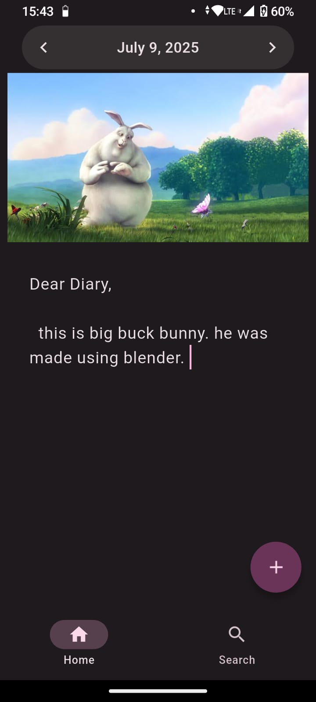

# DearDiary

A simple, elegant, and offline-friendly diary/journaling app built with Flutter — designed to help you jot down thoughts, memories, or notes for each day.


🚧 **Work in Progress** 🚧  
This project is still being actively developed. Some things are incomplete.

## Screenshots

### Android

|  |  |
|----------------------------------------|---------------------------------------|
| Entry View                             | All Entries                           |
| |  |
| Search                                 | Calendar Picker                       |


### Desktop

|  |
|------------------------------------------|
| Entry View                                |

|  |  |
|-------------------------------------------|---------------------------------------------------|
| Entry Editing                              | Responsive Layout                                 |


## Features

- **Date-based Entries**  
  Write diary entries tied to specific dates — past, present, or future.

- **Image Support**  
  Attach a single image to your entry to capture moments visually.

- **Powerful Search**  
  Easily find past memories using keyword search.

- **Calendar Navigation**  
  Jump to any date with a sleek date picker.

- **Offline-first**  
  All data is stored locally using Hive — no internet needed.

- **Adaptive Layout**  
  Optimized UI for mobile, tablet, and desktop.

## Technologies Used

- **Flutter** – Cross-platform UI framework
- **Hive** – NoSQL database
- **Riverpod** – State management

## Planned Features

- [ ] Cloud Sync
- [ ] Multiple Image Support
- [ ] Tags
- [ ] Search Filters
- [ ] App Lock

## Building the app from source

Clone and run:

```
$ git clone https://github.com/yourusername/diary-app.git
$ cd diary-app
$ flutter pub get
$ flutter run
```